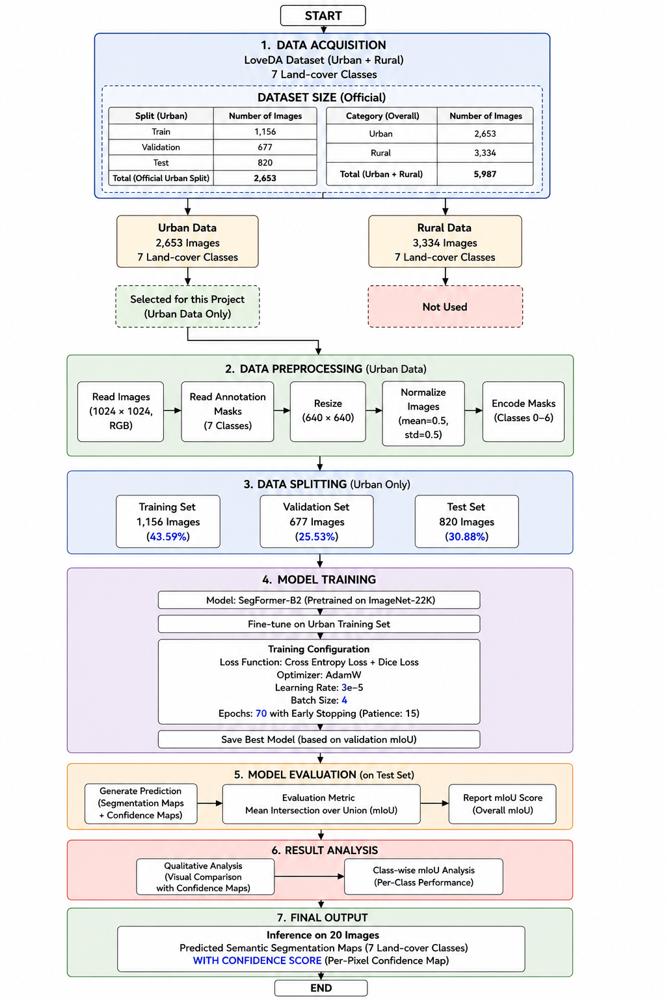

<div align="center">

# 🏙️ City Segmentation Using Deep Learning

### Semantic segmentation of urban satellite imagery with SegFormer-B2 on the LoveDA Urban dataset


</div>

---

## 📌 Table of Contents

- [Overview](#-overview)
- [Dataset](#-dataset)
- [Methodology](#-methodology)
- [Model & Training Configuration](#-model--training-configuration)
- [Evaluation](#-evaluation)
- [Results](#-results)
- [Project Structure](#-project-structure)
- [Getting Started](#-getting-started)
- [Report](#-report)

---

## 🔍 Overview

Urbanization is growing rapidly, and manual interpretation of satellite imagery is slow, labor-intensive and hard to scale across large areas. This project applies deep learning to **automatically segment urban land cover at the pixel level** from high-resolution satellite images.

I fine-tune **SegFormer-B2**, a transformer-based semantic segmentation model pretrained on ImageNet-22K, on the **Urban subset of the LoveDA dataset**. The model produces:

- 🗺️ **Pixel-level segmentation maps** for 7 land-cover classes
- 🎯 **Per-pixel confidence maps** showing how certain the model is about each prediction
- 📊 **Overall and class-wise mIoU** for quantitative evaluation

**Applications:** urban planning, infrastructure development, environmental monitoring, disaster management and land-use analysis.

---

## 📂 Dataset

I use [**LoveDA**](https://github.com/Junjue-Wang/LoveDA) (*A Remote Sensing Land-cover Dataset for Domain Adaptive Semantic Segmentation*), a public high-resolution remote sensing dataset with pixel-level annotations. **Only the Urban subset is used.** The Rural subset is not used.

| Category | Images |
|---|---|
| Urban (used in this project) | 2,653 |
| Rural (not used) | 3,334 |
| **Total (Urban + Rural)** | **5,987** |

**Urban split used in this project**

| Split | Images | Share |
|---|---|---|
| Train | 1,156 | 43.59% |
| Validation | 677 | 25.53% |
| Test | 820 | 30.88% |
| **Total** | **2,653** | 100% |

**Land-cover classes (7)**

| ID | Class |
|---|---|
| 0 | Background |
| 1 | Building |
| 2 | Road |
| 3 | Water |
| 4 | Barren |
| 5 | Forest |
| 6 | Agricultural |

> Note: the exact class-ID order depends on how the masks are encoded in the code. Adjust this table if your encoding differs.

---

## 🧭 Methodology

<div align="center">
  
</div>

The pipeline has seven stages:

1. **Data Acquisition**: download the LoveDA dataset and select the Urban data only.
2. **Data Preprocessing**: read the 1024 × 1024 RGB images and 7-class masks, resize to **640 × 640**, normalize (mean = 0.5, std = 0.5) and encode masks as classes 0 to 6.
3. **Data Splitting**: official Urban split into train (1,156), validation (677) and test (820).
4. **Model Training**: fine-tune SegFormer-B2 and save the best checkpoint by validation mIoU.
5. **Model Evaluation**: generate predictions on the test set and compute mIoU.
6. **Result Analysis**: qualitative (visual comparison with confidence maps) and class-wise mIoU analysis.
7. **Final Output**: inference on 20 images, producing segmentation maps with per-pixel confidence.

---

## ⚙️ Model & Training Configuration

| Setting | Value |
|---|---|
| Model | SegFormer-B2 |
| Pretraining | ImageNet-22K |
| Fine-tuning data | LoveDA Urban training set |
| Input size | 640 × 640 |
| Normalization | mean = 0.5, std = 0.5 |
| Loss function | Cross-Entropy Loss + Dice Loss |
| Optimizer | AdamW |
| Learning rate | 3e-5 |
| Batch size | 4 |
| Epochs | 70 |
| Early stopping | Patience = 15 |
| Model selection | Best validation mIoU |

---

## 📏 Evaluation

The model is evaluated on the **test set** (820 images) using **Mean Intersection over Union (mIoU)**:

```
IoU_c = TP_c / (TP_c + FP_c + FN_c)
mIoU  = (1 / C) * Σ IoU_c
```

I report:

- **Overall mIoU** across all 7 classes
- **Class-wise mIoU** to see which land-cover types are segmented well or poorly

---

## 📈 Results

> 🚧 Results will be added after training and evaluation are complete.

| Metric | Value |
|---|---|
| Overall mIoU (Test) | _TBD_ |

**Class-wise mIoU**

| Class | IoU |
|---|---|
| Background | _TBD_ |
| Building | _TBD_ |
| Road | _TBD_ |
| Water | _TBD_ |
| Barren | _TBD_ |
| Forest | _TBD_ |
| Agricultural | _TBD_ |

**Sample predictions** (satellite image · ground truth · prediction · confidence map)

_Add result images here, for example:_ ``

---

## 🗂️ Project Structure

```
city-segmentation-loveda/
├── assets/                  # Diagrams and result images
│   └── methodology_diagram.png
├── Notebooks/               # SegFormer training and evaluation notebook
├── report/                  # Project report (PDF)
│   └── City_segmentation_using_DL.pdf
├── .gitignore
├── requirements.txt
└── README.md
```

---

## 🚀 Getting Started

**1. Clone the repository**

```bash
git clone https://github.com/sagunrai/city-segmentation-loveda.git
cd city-segmentation-loveda
```

**2. Install dependencies**

```bash
pip install -r requirements.txt
```

**3. Download the dataset**

Download LoveDA from the [official repository](https://github.com/Junjue-Wang/LoveDA) and place the **Urban** train, validation and test folders inside a `data/` folder.

**4. Train and evaluate**

Open the SegFormer notebook in `Notebooks/` and run the cells in order.

---

## 📄 Report

The full project report is available here: [**City Segmentation Using Deep Learning (PDF)**](report/City_segmentation_using_DL.pdf)

---

<div align="center">

⭐ If you find this project useful, consider giving it a star.

</div>
